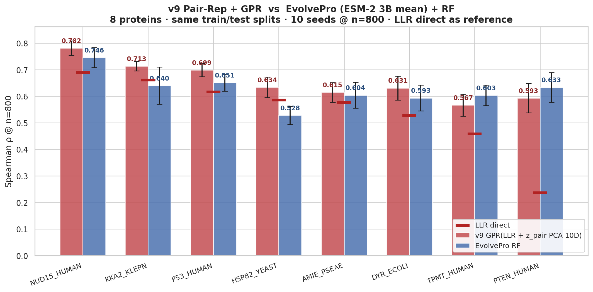
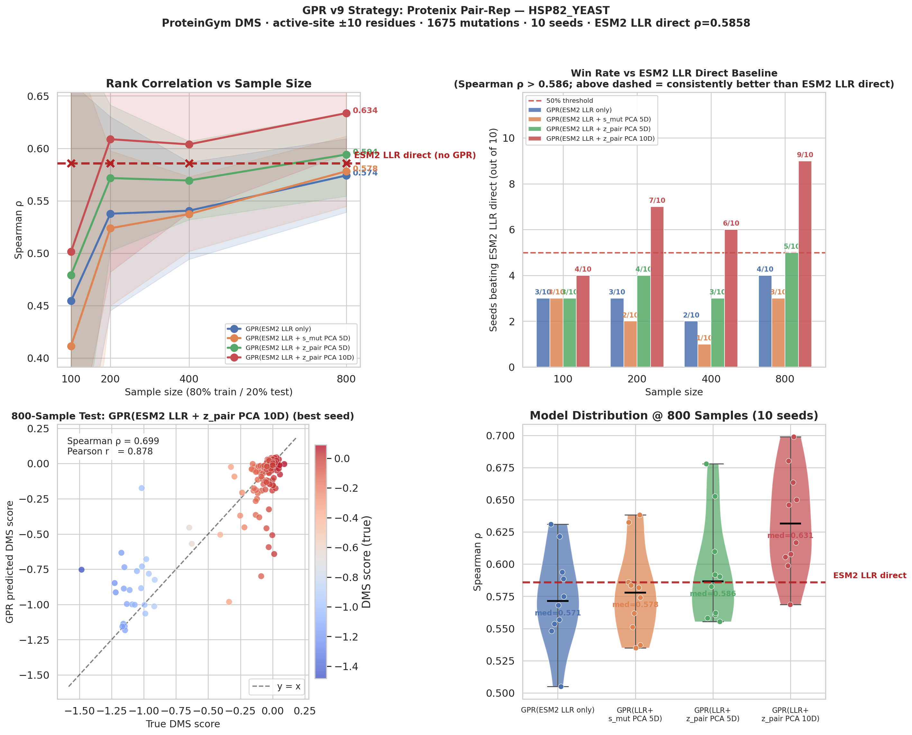

# v9-toolkit

A reproducible pipeline for predicting protein DMS scores using
ESM-2 LLR + Protenix Pairformer pair representation + Gaussian Process Regression.
Strategy follows the v9 protocol validated on BLAT_ECOLX and 8 additional
ProteinGym proteins.

## Quick view of the strategy

```
  DMS CSV  ──►  Step 1 (esm_llr)
                ESM-2 forward pass → per-position log-probs → ESM2 LLR per mutation
                                                │
                                                ▼
                                          features.pkl
                                                │
                Step 2 (pair_rep)               ▼
                Protenix Pairformer per mutated sequence
                  s: (N, 384) | z: (N, N, 128) → 1920D vec per mutation
                                                │
                                                ▼
                                      pair_rep_matrix.npy
                                                │
                Step 3 (gpr)                    ▼
                Active-site WINDOW=10 filter → PCA(z_pair → 10D) → 11D
                4 ablation GPR models × 10 seeds × 4 sample sizes
                                                │
                                                ▼
                              raw_results.csv  +  summary.json  +  figures/
```

## The 4 models compared

All use Matérn(ν=2.5) + WhiteKernel, isotropic length-scale, 3 restarts.

| Model | Input | Total dims |
|-------|-------|-----------|
| GPR(ESM2 LLR only) | LLR | 1D |
| GPR(ESM2 LLR + s_mut PCA 5D) | LLR + PCA(s_mut 384D → 5D) | 6D |
| GPR(ESM2 LLR + z_pair PCA 5D) | LLR + PCA(z 1536D → 5D) | 6D |
| **GPR(ESM2 LLR + z_pair PCA 10D)** ⭐ | LLR + PCA(z 1536D → 10D) | 11D (v9-strict) |

z_pair = z_fwd ⊕ z_rev, the cross-attention pair vectors from the mutation
position to / from the 6 functional-site residues (768 + 768 = 1536D).

## Install

```bash
git clone https://github.com/MinatoooKira/v9-toolkit.git
cd v9-toolkit
pip install -e .

# Pair-rep step also requires Protenix (separate install):
#   https://github.com/bytedance/Protenix
```

## Data

The 10 DMS CSVs used by the validation in [`results/`](results/) ship in
[`data/proteingym_subset/`](data/proteingym_subset/) (15 MB total). The full
217-protein ProteinGym substitutions database (~1 GB) is not stored here —
fetch it on demand with `bash scripts/download_proteingym.sh`. See
[`data/README.md`](data/README.md) for the data schema and citation.

## Quick start

1. Make a YAML config (see `examples/PTEN_HUMAN.yaml`).
2. Provide a DMS CSV with columns `mutant`, `mutated_sequence`, `DMS_score`.
3. Run three stages:

```bash
v9 prep     --config examples/PTEN_HUMAN.yaml   # ESM-2 LLR  (~1-5 min on GPU)
v9 extract  --config examples/PTEN_HUMAN.yaml   # Protenix Pairformer (hours, GPU)
v9 validate --config examples/PTEN_HUMAN.yaml   # GPR + figures (~2 min CPU)
```

Or all-in-one:
```bash
v9 run --config examples/PTEN_HUMAN.yaml
```

On a SLURM cluster:
```bash
sbatch examples/run_pairrep.slurm examples/PTEN_HUMAN.yaml
```

## Two operational modes

### Mode A — DMS evaluation (above)

For benchmark/ablation work: produces the 4-model GPR comparison + figures
shown in `results/`.

### Mode B — Real-experiment train & score (deploy as a tool)

For wet-lab workflows: fit one GPR on your measured mutations, save it, then
score new mutations on demand.

```bash
# 1. Prep + extract pair-rep for your training mutations (one-time)
v9 prep    --config examples/my_experiment.yaml
v9 extract --config examples/my_experiment.yaml

# 2. Train: fit GPR(ESM2 LLR + z_pair PCA 10D) on ALL your data, save scorer.pkl
v9 train   --config examples/my_experiment.yaml --hold-out

# 3. Score new mutations later (any time, repeatable)
echo "mutant" > new_mutants.csv
echo "K53D"  >> new_mutants.csv
echo "Y178A" >> new_mutants.csv
v9 score --model output/MY_ENZYME/scorer.pkl \
         --input new_mutants.csv \
         --output scored.csv \
         --config examples/my_experiment.yaml
```

The `scorer.pkl` is fully self-contained — it bundles the WT sequence, active
sites, PCA + scaler state, and an **ensemble of 10 GPRs** (different
`random_state` seeds, same data). Loading it later only requires GPU access
for ESM-2 / Protenix to featurize the *new* mutations.

Scoring averages all 10 ensemble members and reports **total uncertainty**:
`σ_total = √(aleatoric² + epistemic²)` where aleatoric = mean per-GPR posterior
variance and epistemic = variance across the 10 ensemble means. Use σ for
active-learning / confidence-aware ranking.

Programmatic API:
```python
from v9pipeline.score import Scorer
s = Scorer.load("output/MY_ENZYME/scorer.pkl")
mean, std = s.score_one("K53D", protenix_pipeline)
df = s.score_many(["K53D", "Y178A", "R200K"], protenix_pipeline)
```

## Standardized I/O

**Input** (single YAML config):
```yaml
protein: PTEN_HUMAN
dms_csv: ./data/PTEN_HUMAN_Matreyek_2021.csv
active_sites_1idx: [92, 93, 124, 128, 130, 138]
output_dir: ./output/PTEN_HUMAN

window: 10
sample_sizes: [100, 200, 400, 800]
n_seeds: 10
train_ratio: 0.80
esm_model: esm2_t36_3B_UR50D
esm_layer: 36
truncate_seq_to: null         # for multi-domain proteins where DMS covers a subset
```

**Output** (under `output_dir`):
```
output/PTEN_HUMAN/
├── features.pkl              # ESM2 LLR + DMS + sequences
├── meta.pkl                  # summary metadata
├── pair_rep_matrix.npy       # (N, 1920) Protenix pair-rep features
├── pair_rep_names.pkl        # aligned mutant names
├── raw_results.csv           # 160 rows = 4 models × 10 seeds × 4 sample sizes
├── summary.json              # key metrics
└── figures/
    ├── gpr_validation_PTEN_HUMAN.png   # 4-panel main
    └── gpr_std_PTEN_HUMAN.png          # 3-panel variance/quality
```

## Why active-site WINDOW=10?

For each mutation `X{pos}Y`, keep only mutations within ±10 residues of any
active site. This focuses GPR training on the functionally-coupled subset
where Protenix pair-rep carries the strongest signal.

WINDOW=10 was set by the original v9 BLAT protocol; configurable per protein
via the `window` field.

## Validation results

Pipeline was validated on **8 ProteinGym proteins** + reproduced on
**BLAT_ECOLX** (the original v9 reference). All raw results, CSVs, and
high-resolution figures are in [`results/`](results/).

### Cross-method comparison (v9 vs EvolvePro)

Head-to-head with EvolvePro (ESM-2 3B mean + RandomForest), same train/test
splits and active-site filter:



**v9 wins on 6/8 proteins**. EvolvePro wins on TPMT and PTEN — both have weak
ESM2 LLR baselines where the richer 2560D ESM mean embedding outpaces the 1536D
Protenix pair-rep.

### Per-protein results @ n=800

Effect size = `(mean − ESM2 LLR_direct) / std`:

| Protein | Pair-rep PCA 10D ρ | ESM2 LLR direct ρ | Δ | Effect size | v9 vs EvolvePro |
|---------|--------------------|---------------|----|----------|------------------|
| PTEN_HUMAN | 0.593 | 0.237 | +0.356 | **+6.40σ** | EvolvePro 0.633 |
| NUD15_HUMAN | 0.782 | 0.689 | +0.093 | +3.35σ | **v9 wins** |
| KKA2_KLEPN | 0.713 | 0.661 | +0.052 | +3.01σ | **v9 wins** |
| P53_HUMAN | 0.699 | 0.616 | +0.083 | +3.26σ | **v9 wins** |
| TPMT_HUMAN | 0.567 | 0.459 | +0.108 | +2.61σ | EvolvePro 0.603 |
| DYR_ECOLI | 0.631 | 0.529 | +0.102 | +2.27σ | **v9 wins** |
| HSP82_YEAST | 0.634 | 0.586 | +0.048 | +1.24σ | **v9 wins** |
| AMIE_PSEAE | 0.615 | 0.576 | +0.039 | +1.04σ | **v9 wins** |

Pair-rep PCA 10D **consistently beats ESM2 LLR baseline on all 8 proteins**
(all effect sizes > 0). PTEN_HUMAN shows the largest gain — pair-rep
"rescues" a protein where ESM-2 alone has essentially no predictive signal.

### Example: HSP82_YEAST main figure



GPR(ESM2 LLR + z_pair PCA 10D) reaches Spearman ρ = 0.634 at n=800 (vs ESM2 LLR
direct = 0.586), with 9/10 seeds beating the ESM2 LLR direct baseline. Effect
size +1.24σ — matches the original v9 BLAT reference (+1.26σ) almost exactly,
demonstrating the pipeline reproduces v9-quality results on a new protein.

### BLAT_ECOLX — development case study

`results/v9_BLAT_reference/` documents BLAT_ECOLX, the first protein on which
this strategy was iterated. It carries an extra 4-model comparison that records
the exploration from PAE-based features to Protenix pair-rep:

- GPR(ESM2 LLR only) — sequence-only baseline
- GPR(ESM2 LLR + AF3 conf) — adds AF3 pae_mean + pTM scalars
- GPR(ESM2 LLR + AF3 PAE 8D) — adds 5D PCA of AF3 PAE active-site columns
- GPR(ESM2 LLR + Protenix z 10D) — final design, equivalent to the v9-strict
  model used on the other 8 proteins

The Protenix pair-rep configuration reaches Spearman ρ = 0.78 at n=800. This
4-model breakdown is BLAT-specific (later proteins use Protenix pair-rep only,
without the AF3 ablation) — it preserves the design history for reference.

## Citation

If this toolkit is useful, please cite the upstream tools it depends on:

- **ESM-2**: Lin et al., *Science* 2023
- **Protenix**: ByteDance, https://github.com/bytedance/Protenix

And reference this repository directly:

- **v9-toolkit**: https://github.com/MinatoooKira/v9-toolkit

## License

MIT (see [LICENSE](LICENSE)).
