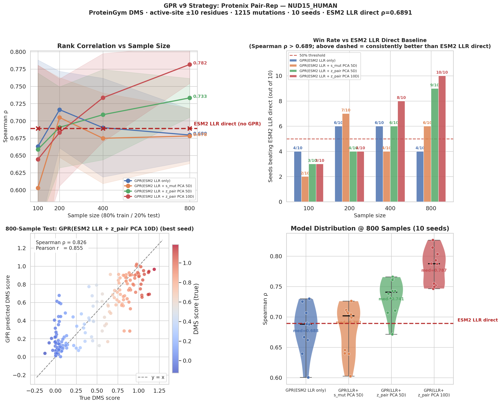
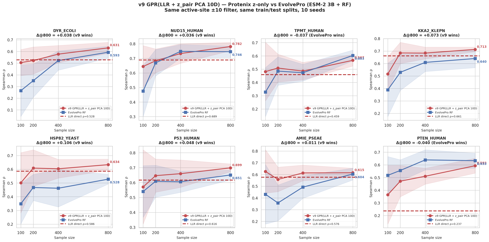

# v9-toolkit

A reproducible pipeline that combines ESM-2 sequence likelihoods, Protenix
Pairformer pair-representations, and Gaussian-Process regression. Used in
two ways:

- **DMS evaluation** — benchmark protein-fitness predictors with a
  4-model × 10-seed × 4-sample-size ablation grid.
- **Wet-lab scorer** — fit a single GPR ensemble on your measured mutations,
  save a self-contained `scorer.pkl`, and predict μ ± σ for new mutants on
  demand from a string like `"K53D"`.

The v9 protocol was validated on BLAT_ECOLX and 8 additional ProteinGym
proteins.

## Who this is for

Mainly **wet-lab teams** with a small set of measured mutations who want
to prioritize the next batch:
> "I measured 200 mutations of my enzyme. Which of the remaining
> candidates is worth screening next?" Train a `scorer.pkl` on what you
> already have, ask it for `μ ± σ` on the rest.

A secondary audience is **researchers who want to reproduce or extend
the v9 validation on their own protein**:
> "Does pair-rep + GPR beat sequence-only baselines on *my* DMS dataset
> the same way it did on the 8 ProteinGym proteins?" Run the same
> 4-model × 10-seed × 4-sample-size ablation grid on your data and find
> out. (This is the same protocol we used to produce the validation in
> `results/` — not a generic benchmark harness.)

### You don't need a full DMS scan

The repo and validation use ProteinGym DMS datasets (thousands of
mutations measured at once) because they're the cleanest public
benchmark. **Your own usage doesn't require DMS-scale data.** A few
hundred measured single-point mutations from your own wet lab are enough
— the active-site `WINDOW=10` filter further focuses training to
~100–1000 functionally-relevant points, well inside GPR's data-efficient
regime. The fitness value can be anything you measure (kcat,
fluorescence, binding affinity, growth rate, …); the input format is
just `mutant, score`.

### Roadmap: combination mutations + active learning

The current toolkit scores single-point mutations. The underlying
Protenix Pairformer is inherently sensitive to pairwise residue
interactions — feeding it a multi-mutation sequence naturally captures
joint structural effects, so the toolkit has clear architectural
potential to extend to combination mutations. We are working on:

- **Active-learning loop** — choose the next batch of *N* mutations to
  measure by ranking on `μ + κ·σ` (UCB) or `σ`-max (exploration),
  closing the experimental design loop.
- **Combination-mutation designer** — generates high-`μ` double / triple
  mutation candidates with combined uncertainty estimates, guiding
  combinatorial library design where the single-mutation scorer alone
  cannot.

Both will be released as separate repositories; this one stays focused
on the single-mutation scoring pipeline.

## What you'll get

For each new mutation, a calibrated mean and uncertainty (this is the
real output from the verified `v9 score` pipeline on BLAT_ECOLX):

```
mutant   predicted_score   predicted_std
M1A     -2.0501           0.8293
S51R    -2.1819           0.7681
R238A   -2.2613           0.8196
```

`predicted_score` (μ) is the 10-GPR ensemble mean; `predicted_std` (σ) is
total uncertainty `√(aleatoric² + epistemic²)`. Together they support
ranking, skipping, or active-learning selection (see [Mode B](#mode-b--real-experiment-train--score-deploy-as-a-tool)
for the decision table).

The underlying GPR is well-calibrated even at modest training sizes:



NUD15_HUMAN example — `GPR(ESM2 LLR + z_pair PCA 10D)` reaches
Spearman ρ = 0.782 at n=800, beating ESM2 LLR direct (ρ = 0.689) on
all 10 seeds (+3.35σ effect size).

## Quick view of the strategy

```
  DMS CSV  ──►  Step 1 (esm_llr)              ESM-2 forward pass → per-position log-probs → LLR
                Step 2 (pair_rep)             Protenix Pairformer per mutated sequence
                                              s: (N, 384) | z: (N, N, 128) → 1920D / mutation
                                                │
                                       features.pkl + pair_rep_matrix.npy
                                                │
                          ┌─────────────────────┴─────────────────────┐
                          ▼                                           ▼
              Mode A (validate)                           Mode B (train + score)
              Active-site filter → PCA                    Active-site filter → PCA →
              4 models × 10 seeds × 4 sizes               fit 10-GPR ensemble on ALL data
                          │                                           │
                          ▼                                           ▼
              raw_results.csv  +  figures/                       scorer.pkl
                                                                      │
                                                                      ▼
                                                      new mutant string ──► live ESM-2 + Protenix
                                                                            ──► μ ± σ_total
```

## The 4 models compared

All use Matérn(ν=2.5) + WhiteKernel, isotropic length-scale, 3 restarts.

| Model | Input | Total dims |
|-------|-------|-----------|
| GPR(ESM2 LLR only) | LLR | 1D |
| GPR(ESM2 LLR + s_mut PCA 5D) | LLR + PCA(s_mut 384D → 5D) | 6D |
| GPR(ESM2 LLR + z_pair PCA 5D) | LLR + PCA(z 1536D → 5D) | 6D |
| **GPR(ESM2 LLR + z_pair PCA 10D)** ⭐ | LLR + PCA(z 1536D → 10D) | 11D (v9-strict) |

z_pair = z_fwd ⊕ z_rev, the cross-attention pair vectors from the mutation
position to / from the 6 functional-site residues (768 + 768 = 1536D).

Mode A trains and compares all four (ablation). **Mode B uses only the ⭐
v9-strict variant** — one `GPR(ESM2 LLR + z_pair PCA 10D)` configuration, fit
as a 10-seed ensemble on your full training set.

## Install

```bash
git clone https://github.com/MinatoooKira/v9-toolkit.git
cd v9-toolkit
pip install -e .

# Pair-rep extraction (Steps 2 / extract / score) also requires Protenix:
git clone https://github.com/bytedance/Protenix
cd Protenix && pip install -e . && cd ..
# (or: export PROTENIX_PATH=/path/to/Protenix if not pip-installed)
```

See [`docs/protenix_setup.md`](docs/protenix_setup.md) for the full Protenix
adapter guide, including SLURM templates and troubleshooting.

## Data

The 10 DMS CSVs used by the validation in [`results/`](results/) ship in
[`data/proteingym_subset/`](data/proteingym_subset/) (15 MB total). The full
217-protein ProteinGym substitutions database (~1 GB) is not stored here —
fetch it on demand with `bash scripts/download_proteingym.sh`. See
[`data/README.md`](data/README.md) for the data schema and citation.

## Quick start

1. Make a YAML config (see `examples/PTEN_HUMAN.yaml`).
2. Provide a DMS CSV with columns `mutant`, `mutated_sequence`, `DMS_score`.
3. Run three stages:

```bash
v9 prep     --config examples/PTEN_HUMAN.yaml   # ESM-2 LLR  (~1-5 min on GPU)
v9 extract  --config examples/PTEN_HUMAN.yaml   # Protenix Pairformer (hours, GPU)
v9 validate --config examples/PTEN_HUMAN.yaml   # GPR + figures (~2 min CPU)
```

Or all-in-one (Mode A):
```bash
v9 run --config examples/PTEN_HUMAN.yaml
```

Or **deploy as a wet-lab scorer** (Mode B):
```bash
v9 prep    --config my_experiment.yaml
v9 extract --config my_experiment.yaml
v9 train   --config my_experiment.yaml --hold-out      # → scorer.pkl
echo -e "mutant\nK53D\nY178A" > new.csv
v9 score   --config my_experiment.yaml --model output/MY_EXP/scorer.pkl \
           --input new.csv --output scored.csv         # → μ ± σ per mutant
```

On a SLURM cluster:
```bash
sbatch examples/run_pairrep.slurm examples/PTEN_HUMAN.yaml
```

## Two operational modes

### Mode A — DMS evaluation (above)

For benchmark/ablation work: produces the 4-model GPR comparison + figures
shown in `results/`.

### Mode B — Real-experiment train & score (deploy as a tool)

For wet-lab workflows: fit one GPR on your measured mutations, save it, then
score new mutations on demand. See the [Mode B Quick start](#quick-start)
above for the command sequence.

The `scorer.pkl` is fully self-contained — it bundles the WT sequence, active
sites, PCA + scaler state, and an **ensemble of 10 GPRs** (different
`random_state` seeds, same data). Loading it later only requires GPU access
for ESM-2 / Protenix to featurize the *new* mutations.

`v9 score` runs the full ESM-2 + Protenix featurization on each new mutation
live — you only supply mutant strings (no pre-extracted pair-rep needed).
On a single GPU, expect ~1 min model load + 1–3 s per mutation. Verified
end-to-end on RTX 4090 / 5090.

Scoring averages all 10 ensemble members and reports **total uncertainty**:
`σ_total = √(aleatoric² + epistemic²)` where aleatoric = mean per-GPR posterior
variance and epistemic = variance across the 10 ensemble means.

#### Interpreting the score + uncertainty in practice

Each scored mutation comes back with `predicted_score` (μ) and `predicted_std`
(σ). The two together support common wet-lab workflows:

| (μ, σ) pattern | Interpretation | Suggested action |
|---|---|---|
| **High μ, low σ** | Model is confident this mutation is good | Prioritize for wet-lab confirmation |
| **Low μ, low σ** | Model is confident it's bad | Skip — save reagents |
| **Any μ, high σ** | Model is uncertain (training set is sparse near this mutation) | Active-learning candidate — measuring it most informs the model |
| **High μ, moderate σ** | Plausibly good but worth verifying | Include in next round if budget allows |

**Two flavors of uncertainty inside σ**:

- **Aleatoric** (per-GPR posterior variance, averaged): "given the kernel I
  learned, how confident is one GPR about this point?" Reflects how far the
  mutation is from training data in feature space.
- **Epistemic** (variance across the 10 ensemble means): "do different kernel
  optimization runs agree on this mutation?" Large epistemic σ signals that
  the kernel shape itself is under-constrained — typically means the training
  data doesn't pin down the right model in this region.

For active learning, rank by σ (or by an acquisition function like
`μ + κ·σ` with κ≈2) to pick the next batch of mutations to measure.

Programmatic API:
```python
from v9pipeline.protenix_loader import ProtenixPipeline
from v9pipeline.score import Scorer

pipe = ProtenixPipeline()                          # one-time model load (~30s)
s    = Scorer.load("output/MY_ENZYME/scorer.pkl")
mean, std = s.score_one("K53D", pipe)
df         = s.score_many(["K53D", "Y178A", "R200K"], pipe)
```

## Standardized I/O

**Input** (single YAML config):
```yaml
protein: PTEN_HUMAN
dms_csv: ./data/PTEN_HUMAN_Matreyek_2021.csv
active_sites_1idx: [92, 93, 124, 128, 130, 138]
output_dir: ./output/PTEN_HUMAN

window: 10
sample_sizes: [100, 200, 400, 800]
n_seeds: 10
train_ratio: 0.80
esm_model: esm2_t36_3B_UR50D
esm_layer: 36
truncate_seq_to: null         # for multi-domain proteins where DMS covers a subset
```

**Output** (under `output_dir`):
```
output/PTEN_HUMAN/
├── features.pkl              # ESM2 LLR + DMS + sequences         [shared]
├── meta.pkl                  # summary metadata                   [shared]
├── pair_rep_matrix.npy       # (N, 1920) Protenix pair-rep        [shared]
├── pair_rep_names.pkl        # aligned mutant names               [shared]
├── raw_results.csv           # 160 rows = 4 × 10 × 4              [Mode A]
├── summary.json              # key metrics                        [Mode A]
├── scorer.pkl                # self-contained 10-GPR ensemble     [Mode B]
├── scorer_summary.json       # training metrics + held-out ρ      [Mode B]
└── figures/
    ├── gpr_validation_PTEN_HUMAN.png   # 4-panel main
    └── gpr_std_PTEN_HUMAN.png          # 3-panel variance/quality
```

## Why active-site WINDOW=10?

For each mutation `X{pos}Y`, keep only mutations within ±10 residues of any
active site. This focuses GPR training on the functionally-coupled subset
where Protenix pair-rep carries the strongest signal.

WINDOW=10 was set by the original v9 BLAT protocol; configurable per protein
via the `window` field.

## Validation results

The numbers below are from **Mode A** (ablation grid). They quantify how
much pair-rep beats LLR alone, justifying Mode B's choice to fix the
v9-strict model. For your own data, `v9 train --hold-out` reports the
matching held-out Spearman on your training set.

Pipeline was validated on **8 ProteinGym proteins** + reproduced on
**BLAT_ECOLX** (the original v9 reference). All raw results, CSVs, and
high-resolution figures are in [`results/`](results/).

### Feature-representation comparison (v9 vs EvolvePro-style features)

> **Note**: this is a *feature* comparison under v9's evaluation protocol,
> **not** a head-to-head of the full EvolvePro method. See [Methodology
> notes](#methodology-notes-on-the-evolvepro-comparison) below.


Per-protein learning curves (Spearman ρ vs training sample size):



**Under this harness, v9's features win on 6/8 proteins.** EvolvePro-style
wins on TPMT and PTEN — both have weak ESM2 LLR baselines where the richer
2560D mean embedding carries more residual information than the 1536D
Protenix pair-rep does.

#### Methodology notes on the EvolvePro comparison

We swap only the features; everything else (active-site filter, train/test
protocol, sample sizes, seeds) is held constant.

|             | Features                                       | Regressor |
|-------------|------------------------------------------------|-----------|
| v9          | ESM-2 LLR + Protenix z_pair PCA 10D (11D)      | GPR (Matérn + WhiteKernel) |
| EvolvePro-style | ESM-2 mean-pool (2560D)                    | RandomForest, hyperparams copied verbatim from [`evolvepro/src/model.py`](https://github.com/mat10d/EvolvePro) |

**Where this departs from the official EvolvePro protocol:**

- Backbone: official default is **ESM-2 15B**; we use **3B** (matched to v9 for fair feature comparison).
- Selection loop: official runs an **iterative active-learning loop** with an acquisition function (UCB / greedy); we run **single-shot random 80/20 train/test** at fixed sample sizes.
- Filtering: official applies **no active-site filter**; we force `WINDOW=10` for consistency with v9.

So the absolute "EvolvePro-style" numbers above should **not** be read as
EvolvePro's headline performance — its iterative active-learning protocol
scores higher than this harness reports. What this comparison isolates is
*which feature representation carries more usable signal when the protocol
is held fixed*.

### Per-protein results @ n=800

Effect size = `(mean − ESM2 LLR_direct) / std`:

Bold marks the higher of v9 / EvolvePro-style on each row.

| Protein | Pair-rep PCA 10D ρ | ESM2 LLR direct ρ | Δ vs LLR | Effect size | EvolvePro-style ρ |
|---------|--------------------|---------------|----------|----------|------------------|
| PTEN_HUMAN  | 0.593 | 0.237 | +0.356 | **+6.40σ** | **0.633** |
| NUD15_HUMAN | **0.782** | 0.689 | +0.093 | +3.35σ | 0.746 |
| KKA2_KLEPN  | **0.713** | 0.661 | +0.052 | +3.01σ | 0.640 |
| P53_HUMAN   | **0.699** | 0.616 | +0.083 | +3.26σ | 0.651 |
| TPMT_HUMAN  | 0.567 | 0.459 | +0.108 | +2.61σ | **0.603** |
| DYR_ECOLI   | **0.631** | 0.529 | +0.102 | +2.27σ | 0.593 |
| HSP82_YEAST | **0.634** | 0.586 | +0.048 | +1.24σ | 0.528 |
| AMIE_PSEAE  | **0.615** | 0.576 | +0.039 | +1.04σ | 0.604 |

Pair-rep PCA 10D **consistently beats ESM2 LLR baseline on all 8 proteins**
(all effect sizes > 0). PTEN_HUMAN shows the largest gain — pair-rep
"rescues" a protein where ESM-2 alone has essentially no predictive signal.

### BLAT_ECOLX — development case study

`results/v9_BLAT_reference/` documents BLAT_ECOLX, the first protein on which
this strategy was iterated. It carries an extra 4-model comparison that records
the exploration from PAE-based features to Protenix pair-rep:

- GPR(ESM2 LLR only) — sequence-only baseline
- GPR(ESM2 LLR + AF3 conf) — adds AF3 pae_mean + pTM scalars
- GPR(ESM2 LLR + AF3 PAE 8D) — adds 5D PCA of AF3 PAE active-site columns
- GPR(ESM2 LLR + Protenix z 10D) — final design, equivalent to the v9-strict
  model used on the other 8 proteins

The Protenix pair-rep configuration reaches Spearman ρ = 0.78 at n=800. This
4-model breakdown is BLAT-specific (later proteins use Protenix pair-rep only,
without the AF3 ablation) — it preserves the design history for reference.

## Citation

If this toolkit is useful, please cite the upstream tools it depends on:

- **ESM-2**: Lin et al., *Science* 2023
- **Protenix**: ByteDance, https://github.com/bytedance/Protenix

And reference this repository directly:

- **v9-toolkit**: https://github.com/MinatoooKira/v9-toolkit

## License

MIT (see [LICENSE](LICENSE)).
